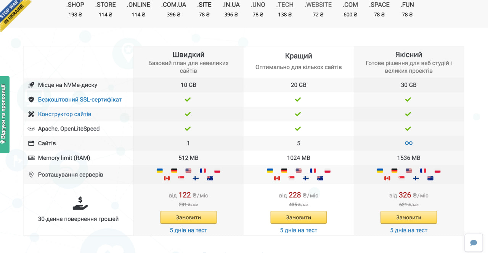

<link rel="stylesheet" href="https://cdnjs.cloudflare.com/ajax/libs/font-awesome/6.5.2/css/all.min.css" /> 

# Налаштування хостингу

<blockquote>

<i class="fas fa-user-edit"></i> Автор ідеї та втілення: <strong>Олександр Мороз (WpDews)</strong> 
<i class="fas fa-envelope"></i> E-mail: <a href="mailto:aleksmorro@gmail.com">aleksmorro@gmail.com</a> 
<i class="fa-brands fa-telegram"></i> Telegram: <a href="https://t.me/WpDews">WpDews</a>

</blockquote>

Для товарки рекомедую використовувати [ХОСТИНГ УКРАЇНА](https://www.ukraine.com.ua/?page=72198) Базовий план.

 

На час написання документації ціни та якість послуг відповідають вимогам. Одною з переваг є можливість встановлення SSL сертифікату безкоштовно. Зручність адмініструваання та підтримка також на високому рівні.

Також на хостингу є можливість блокування IP адрес, що дозволяє захистити сайт від атак.

## Відео по роботі з хостингом:

<iframe src="https://www.youtube.com/embed/oQ5OkaulmTE" allowfullscreen></iframe>

## Перевірка домену перед покупкою

Перед покупкою домену рекомендую перевірити його на наявність вірусів та інших проблем. Для цього використовуйте сервіс [VirusTotal](https://www.virustotal.com/gui/home/upload).

Та відладчик репостів на Facebook [Facebook Debugger](https://developers.facebook.com/tools/debug/).

## СРМ системи

Є можливість підключення до різних CRM систем, таких як:

- [1. Salesdrive](https://salesdrive.com.ua/)
- [2. KeyCRM](https://keycrm.com/)
- [3. LP-CRM](https://lp-crm.com/)

Посилання на срм в списку, на мою думку, за якістю, ціною та зручністью використання.

